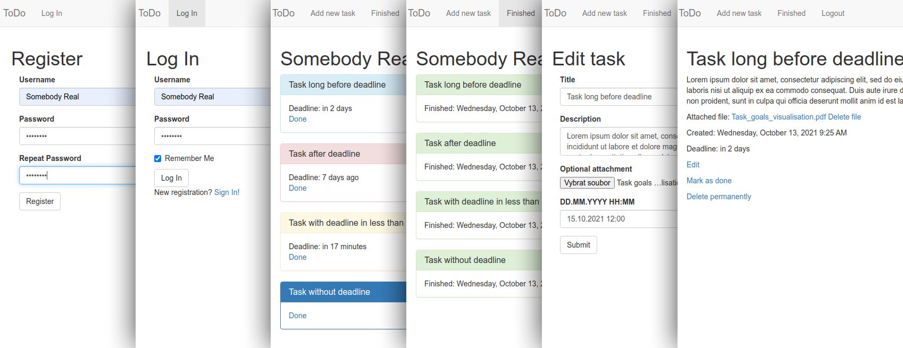

# TODO in Flask
**WORK IN PROGRESS**  
Skeleton of simple ToDo app. Written in Python (3.9+) using Flask and Bootstrap. It can be used as a starting point to create something more advanced.  

  
## Features overview
- user registration (can be deactivated in the configuration)
- login to user account (with *remember me* option)
- add new task
    - title
    - description (optional)
    - one file attachment (optional)
    - deadline (optional)
- curent tasks overview
    - number of active tasks
    - 4 colors according to the task state
    - link to task detail
    - time difference with respect to the deadline (if set)
    - link to mark the task as completed
- finished tasks overview
    - number of finished tasks
    - tasks completion time
- task detail
    - editable
    - with time of creation
    - link to attachment (if any)
    - the ability to permanently delete a task
## Application structure - only necessary
```
todo
│   run.py   
│   config.py
│
└───app
│   │   __init__.py
│   │   forms.py
│   │   models.py
│   │   routes.py
│   │
│   └───templates
│       │   layout.html
│       │   ... 
│
└───migrations
    │   ... 
```
**run.py** - starting script, loads main app, debug option switcher  
**config.py** - Flask and app basic configuration, DB path, upload path, max filesize, file extensions allowed  
**__init__.py** - joining all parts together  
**forms.py** - forms used in templates and their validation  
**models.py** - SQAlchemy DB models and their methods  
**routes.py** - mapping of URL pathes to function calls  
**templates** - Jinja templates in html  
**migrations** - keeping track of DB changes and their migrations, used for DB upgrade  

## Installation and running (development)
1. clone repository
2. create and activate Python virtual environment (tested on python 3.9.+ but should work in 3.7.+)
3. install dependencies `pip install -r requirements.txt`
4. create local DB `flask db upgrade` (creates *todo.db*, SQLite, in the root folder of the application , with the tables created)
5. run the app `python run.py`
## Possible next steps (ToDo)
- [ ] **tests**
- [ ] **more advanced user account:** email, editable profile page, password recovery, statistics, export to various file formats, deleting an account
- [ ] **search function:** titles, body
- [ ] **date-time picker in JS**
- [ ] **tasks filtering**
- [ ] **optional email notification**
- [ ] **supervisor account**
